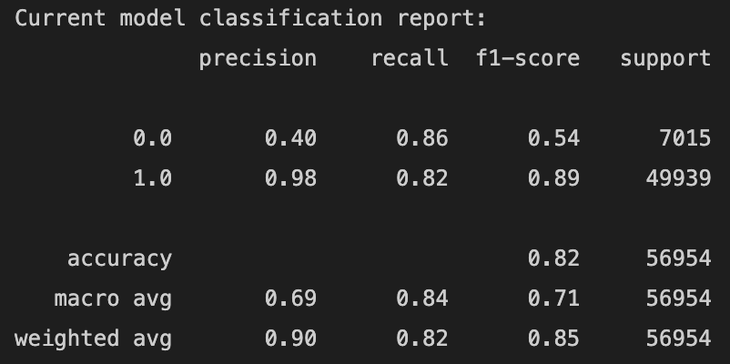

# Gender-Prediction-Assessment

## Objective -
Objective of this exercise is to accurately infer the gender of given set of devices using a machine learning approach. We need to predict the unknown gender for devices based on their device Information, app usage, app description and other features.

## Data -
The following datasets are provided : 
1. Train Dataset and Test Dataset containing deviceId – “ifa” and other aggregated information along with target variable “gender”
2. App Metadata dataset containing app, app description and other information regarding apps. There could be multiple keys here like appId, id, bundleId, etc.. Choose the id the would help utilize the dataset most in conjunction with other datasets.
3. User App propensity dataset containing deviceId - “ifa” and propensity measure against apps (“bundle”) for all deviceIds (both train and test dataset)

## Approach Outline -
- Data Preprocessing (Merging data frames)
- EDA 
- Data Visualization
- Null values - Imputation
- Handling Outliers
- Scaling, Feature Extraction, Dimensionality Reduction approaches (PCA) & Scree Plot
- Class Imbalance Techniques - Random Undersampling, Random Oversampling, SMOTE, NearMiss, SMOTEENN, SMOTETomek
- Classification models (Logistic Regression, LDA, KNN Classifier, AdaBoost, XGBoost, Gradient Boosting Classifier, Random Forest Classifier, Extra Trees Classifier, Light GBM, CatBoost) & Voting Classifier (Soft & Hard)
- GridSearchCV (*Couldn't hypertune for all models)

## Results -
- Best Model performance - with Voting Classifier(Soft) - 
- roc_auc_score score is : 0.836
- accuracy score is : 0.821
- average_precision_score score is : 0.9576

## Submission -
Test Data - merged with app data 
Test Data - Scaled and run with the best performing model 
- predicted.csv file
